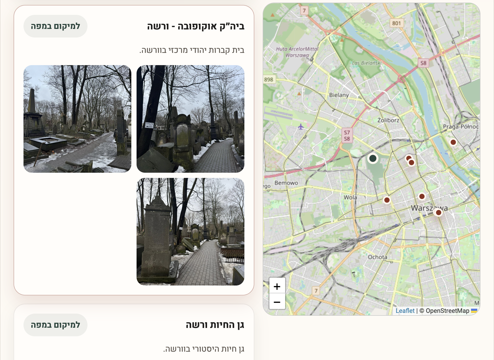
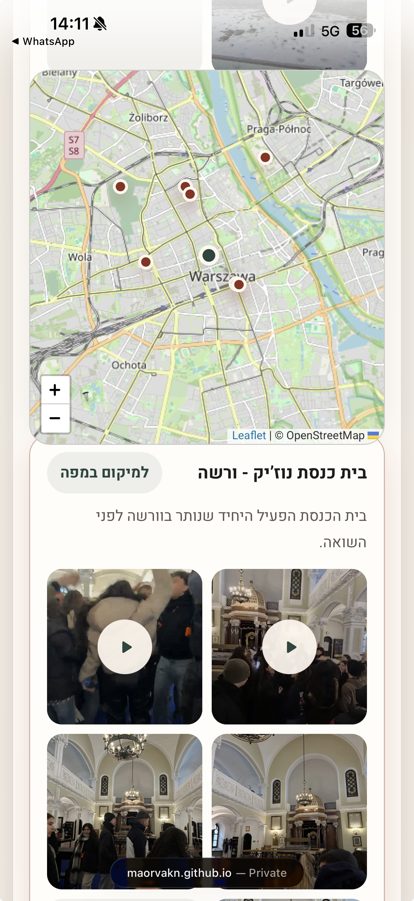

# Poland Delegation Website 2026

A memorial and documentation website created for the 2026 Poland delegation.  
The website brings together the journey's locations, photos, videos, and stories in one place, preserving the experience, memory, and meaning of the trip for the participants and the wider community.

The journey took place during a particularly sensitive time, while the Iranian attack was unfolding. Because of that, the website also documents an unusual and meaningful experience: a journey shaped by Holocaust remembrance, Jewish identity, personal responsibility, and an ongoing connection to the State of Israel.

This project was created entirely on a volunteer basis, out of a desire to honor the journey and the people who took part in it.

## Technologies

The project is built as a simple, accessible static website, without a content management system.


- **HTML** - page structure, content sections, main video area, map, and galleries.
- **CSS** - responsive design, mobile support, content sections, cards, and modals.
- **JavaScript** - data loading, dynamic location cards, map interactions, video modals, and user experience behavior.
- **Leaflet** - an interactive map library used to display the journey's locations.
- **JSON** - a central data file containing the journey stops, coordinates, descriptions, photos, and videos.

## Project Structure

```text
.
├── index.html
├── styles.css
├── script.js
├── screenshots
│   ├── map.png
│   └── mobile-map.png
└── data
    ├── locations.json
    ├── images
    └── videos
```

## Screenshots

### Desktop Map View



### Mobile Map View



## Website Content

- An interactive journey map with key locations in Poland and Israel.
- A local photo gallery from the delegation.
- Videos from different stops along the journey.
- A credits and remembrance section for the team and participants.

## Local Development

It is recommended to run the website through a local server so that `data/locations.json` loads correctly:

```bash
python3 -m http.server 8000
```

Then open the website in the browser:

```text
http://localhost:8000/
```

## Credits

This website was built entirely on a volunteer basis for the memory of the 2026 Poland delegation.

Special thanks:

- Maor Vaknin - website design and development

All photos and videos displayed on the website are shown with the approval of the people featured in them.
